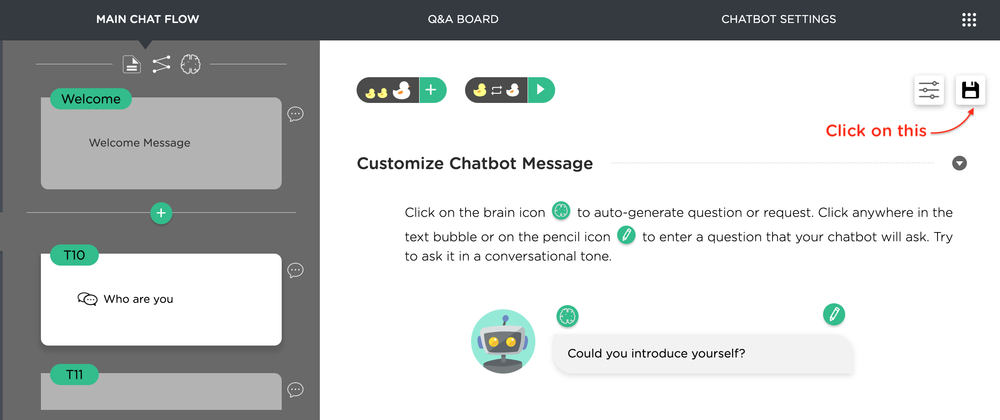
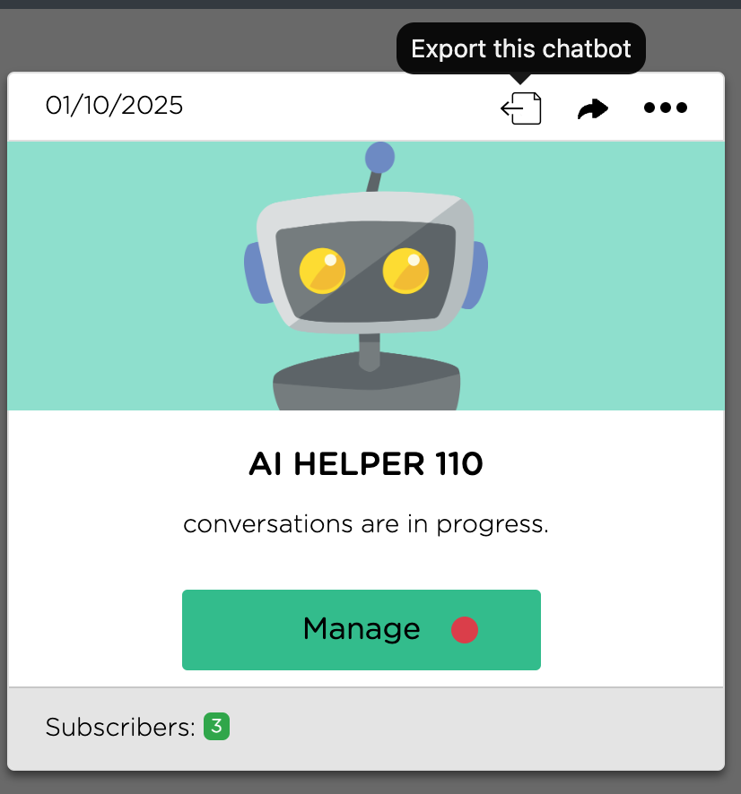
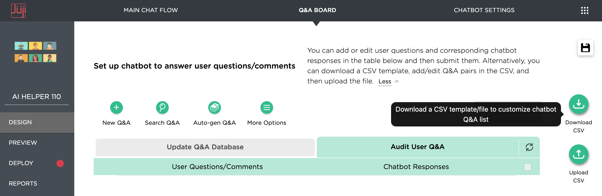
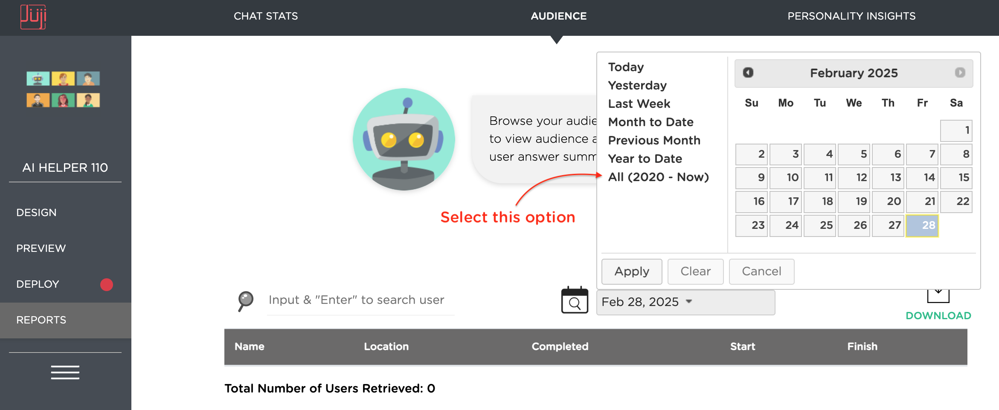

# **Download Juji Chatbot and Assets**

You can export or download your Juji chatbot (AI agent) and associated assets.

## **Export Juji Chatbot**

Juji chatbot is a full-fledged AI agent that often performs non-trivial tasks, such as advising, counseling, and coaching. When you download your chatbot, you will retain all its design, including the main agentic workflow and all configurations. If you have customized your chatbot, your custom AI chatbot contains much intelligence and content (e.g., custom agentic workflows) that are unique to you.

You can export your Juji chatbot in two ways:

### **Inside the chatbot**
If you are inside this chatbot, click on the "floppy disk" icon to download it - this will result in a .juji file. In case the Juji platform continues, you can simply upload this file to restore your AI chatbot. See the screenshot below.

### **Outside the chatbot**
If you are outside of the chatbot, click on the "Export" button as shown below.

## **Download Juji Chatbot Knowledgebase**

Your Juji chatbot is often associated with a custom knowledge base, also known as the Q&A board. Such information can also be downloaded for safe keep. The downloaded content is in a readable format (e.g., in CSV) so you could potentially import the content into another system if needed.

Go inside your chatbot and follow the steps below: 

* Click on "DESIGN"
* Click on "Q&A Board" located on the top menu bar
* Click on "Download CSV" as shown below
* When the download pop-up window shows up, we strongly suggest that you select ALL to download everything including unanswered questions.

## **Download Juji Chatbot Audience Info**

If your chatbot has been running for a while, you might have a number of users. Although the users interacted with your chatbot anonymously, their chat transcripts may help you improve your chatbot later. So we also suggest that you download your audience information for safe keep.

Go inside your chatbot and then follow the steps:

* Click on "Reports"
* Click on "Audience" tab - which is located at the top menu bar
* Click on the calendar icon. Then select the option "All (2020 - Now)" as shown below. This may take a while if you have many users in the past. 
* Click on the "Download" button. In the download pop-up window, again, we suggest that you download CSV as well as the full transcripts for future potential use.

