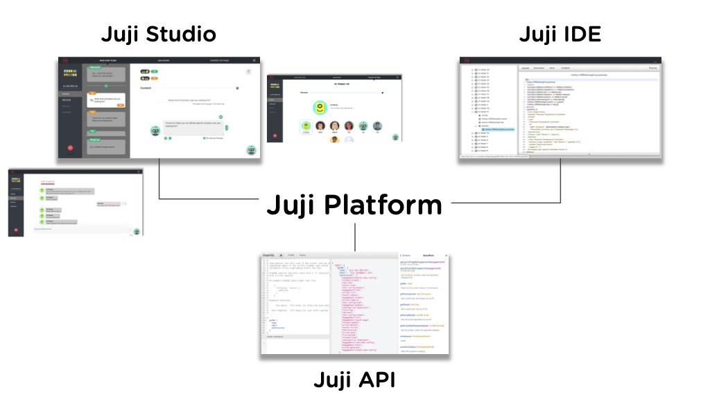
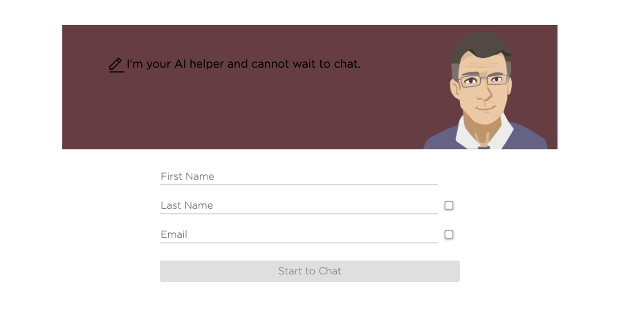

# **The Juji Platform**

The Juji platform is the easiest and best way to create, customize and deploy the most advanced Conversational Artificial
Intelligence (AI) Assistants on the market. Currently, our advanced AI assistants
engage users in text-based, natural language conversations to
accomplish a wide variety of tasks, from answering user inquiries
and making personalized product recommendations to more complicated interactions in digital healthcare and other challenging domains. 

Also known as **AI Chatbots**, our Juji AI assistants can handle complex and diverse user inputs, infer users' implicit needs and wants, and use such
understanding to deliver truly hyper-personalized guidance and services. And here's the best part. Because of the way out software is built, we handle most of the heavy lifting for you, so you can focus on the structure and writiing of the the conversation, and the personality of your chatbot. 

The Juji Platform is made up of three main components, but most of your work (unless your a developer) can be handled in our easy to use Juji Studio. 

  **[Juji Studio](juji-studio)** provides a graphical user interface (GUI) for
  **everyone**, with or without technical skills or AI knowledge, to
  rapidly create, customize, test, and deploy AI chatbots **with no
  coding required**. It's also easy to understand, fun and fast to use, and if you're the creative sort, that's good news for your creative flow. 

  **[Juji IDE](juji-ide)** enables people with minimal coding skills (e.g.,
  ability to write HTML) to power AI chatbots with advanced capabilities (e.g.,
  customizing product recommendation policies). It provides an
  interactive development environment that allows chatbot developers
  to write, compile, and preview AI chatbots using a high-level, [chatbot
  scripting language](reference). So you don't even have to be a nerd to use the IDE, just someone with an intermediate level of understanding of simple computer language. These days a good chunk of peeps can handle the IDE pretty well. That means even the most complex of Juji's elements is probably less complex than the 'basic' chatbot engines of some of our more illustrious competitors.  

  **[Juji API](api)** enables software engineers to embed Juji AI chatbots in
    different applications (e.g., mobile or web-based
    applications). While Juji Studio supports the rapid creation and
    customization of an AI chatbot, [Juji
    API](https://docs.juji.io/api/) allows rapid and easy integration
    of such a chatbot into third-party applications. With our rock-solid API Juji bots can be integrated just about anywhere. 

## **Get Started on Juji**

 <iframe width="560"
height="315" src="https://www.youtube.com/embed/fzL4apEOdLk"
frameborder="0" allow="accelerometer; autoplay; encrypted-media;
gyroscope; picture-in-picture" allowfullscreen></iframe>

Getting started on Juji is very easy. Most of the time the "10 minute chatbot" is a damaging delusion. But not with Juji. The reason is simple. Every Juji bot already has every part of Juji's extensive libraries and world beating functionalities available to it even if you just start it by saying, Oh, I don't know, let's shoot for something original like "Hello world". In other words, to get you to the first ten minute bot that actually works, took us years of work.

The visuals below summarize the key steps to creating and deploying
your first AI chatbot on Juji **in just a few minutes**. And this time it's not BS. 

### **Create an account**

Sign up [here](https://juji.ai/signup) and follow the simple steps to
create a Juji account with only a working email.

### **Create First AI Chatbot**

After signing in, you can now create your first AI chatbot. Click on
the red `+ AI Helper` button and follow the process to select `Say
hello world` template.
    
### **Preview Chatbot**

Now your chatbot is ready to have a conversation with you. Just say
'hello' to your bot as you would to a friend. 

### **Deploy Chatbot**

By clicking on the `Deploy` button on the left menu panel, you can now
publish the chatbot with a few clicks to meet your audiences on
Facebook or the web.

**Your first AI chatbot is now live** :tada: :fireworks: :dizzy:

You chatbot can now engage with your target audience on your Facebook
page:

or your website:

### **Monitor Chatbot**

Juji also helps you monitor your chatbot activities and summarize
audience information. Check out [**Reports Dashboard**](reports)
for more details. 

## **What's Next**

Your AI chatbot can be very powerful: it can help you scale out traditional
labor-intensive operations with a personal touch. For example, your AI
chatbot can handle customer inquiries, make personalized product
recommendations, and elicit customer reviews, 24x7 and always with a
cool and upbeat attitude :sunglasses:  Now lets customize your chatbot to make it truly awesome.

### [**Customize Chatbot**](design)

