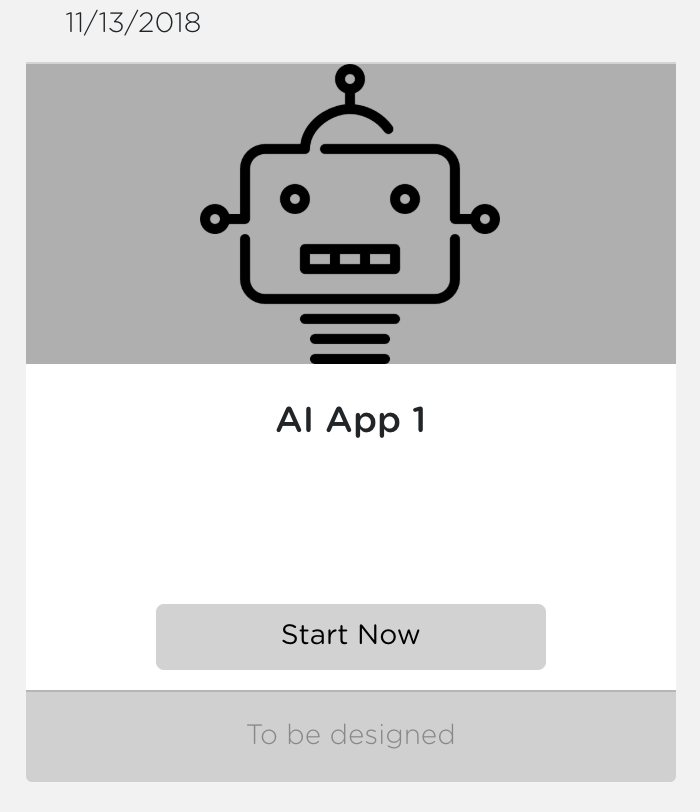
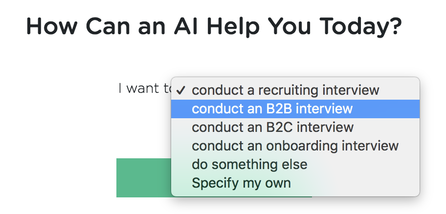
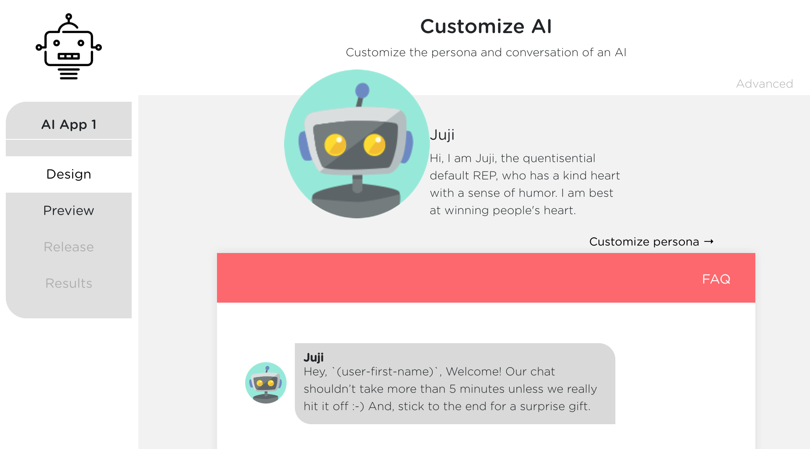
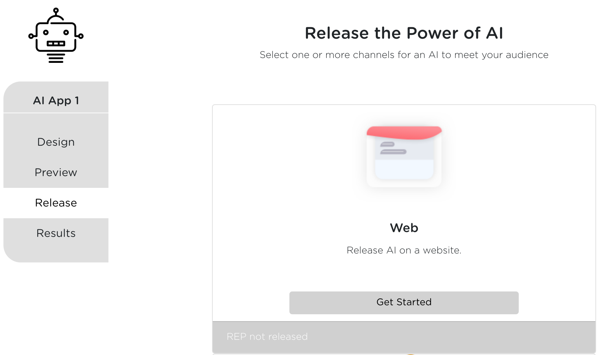
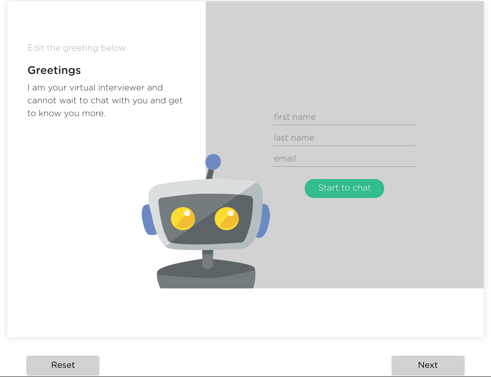

# Get Started on Juji

Thank you for using Juji. By following our guides, you will be creating chatbots in no time.

## Create an account

Head over to https://juji.io/signup

All you need for creating an account on Juji platform is a working email
address.

## Create your first chatbot

After you sign in to Juij, follow these simple steps to create and deploy your
first Juji chatbot.

Click the green `+ AI Helper` button to start creating your first AI bot:

Your first bot is called "AI App 1" by default, you can change the name later.

Click the `Start Now` button, you can now choose a template for your bot.

Choose any one template, say `conduct an B2B interview`, and click `Continue` button.

Now you get to a page where you could customize your bot. But let us not get too
far ahead of ourselves, instead check out what the bot can do right now.

Click `Preview` button at the left menu, and wait a few seconds.

Now we see that our first bot starts the chat. You can chat with the bot to see
how it does. It is pretty cool, huh?

Now let's release the bot to the world! Click `Release` menu on the left.

Click `Get Started` button on the `Web` channel.

Now you get to a page where you could customize the cover page of your bot. We
can do that later. Click `Next` at the right bottom.

Click `Generate URL`

Now your bot is deployed.

You have two URLs. The first URL is the production deployment of your bot. The
second URL is for sending to your friends for testing. The two URLs host the
same chat bot, but the later will not mess up your results reporting.

## Chat with your first chatbot

Point your browser to the URL above.

Only first name is required for chatting with Juji bots (but is configurable by you).

You are now chatting with your first deployed Juji bot!
