# Get Started on Juji

Thank you for using Juji. By following our guide, you will be creating chatbots in no time. 

<!-- You may also start with this three-minutes video:

<iframe width="560" height="315" src="https://www.youtube.com/embed/wyElX2Py6gQ" frameborder="0" allow="accelerometer; autoplay; encrypted-media; gyroscope; picture-in-picture" allowfullscreen></iframe> -->

## Create an account

If you have not done so, head over to https://juji.io/signup to create an account.

All you need for creating an account on the Juji platform is a working email
address.

## Create your first chatbot

After you sign in to Juji, you arrive at the Dashboard. The Dashboard shows all the chatbots you have created. 

Right now, you probably have no chatbot. Please feel free to follow the simple steps below to create and deploy your
first Juji chatbot &#x1F929;.

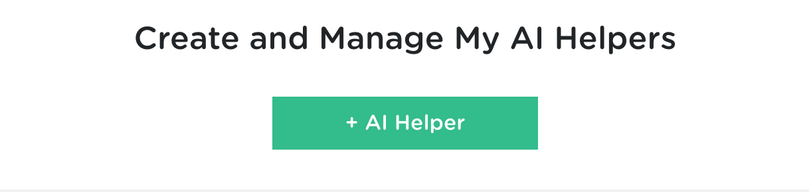

Click the red `+ AI Helper` button to start creating your first bot.

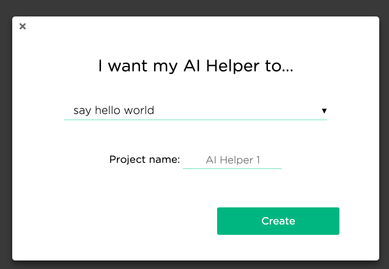

Here you can choose the template you would like to start with. How about `say hello world`?

Your first bot is called `AI Helper 1` by default, you can change the name here, or whenever you like in the Dashboard.

Click the green `Create` button when you are ready to proceed.

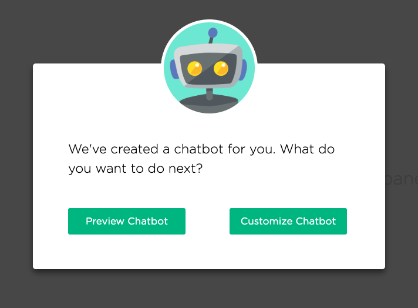

After you create a new chatbot, you have the choice to start customizing it or preview it. Let's take a look at what's in the template first by choosing `Preview Chatbot`.

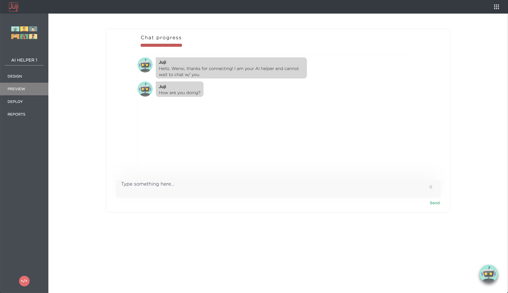

After less than a minute of preparation time, you will see the your chatbot starts the conversation. What's so cool is that now you can already chat with the chatbot &#x1F973;.

What's more? You are just a few clicks away from showing the chatbot to your audiences on facebook. 

## Deploy your chatbot to facebook

Let's say you really want to show the chatbot right away or you already done some [customization on the design page](design.md) without reading any documentation (because our app is so easy to use &#x1F920;), you can now navigate to the deploy page by clicking on `DEPLOY` on the left panel.

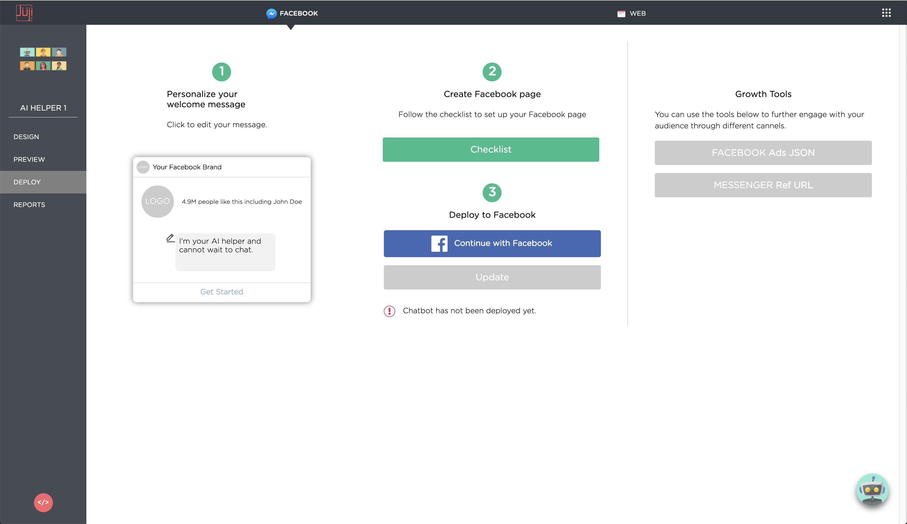

Proceed by clicking `Continue with Facebook` button, which leads you to the facebook permission setting page. Once you follow through the permission settings, you can select the Facebook page(s) you want to deploy your chatbot to.

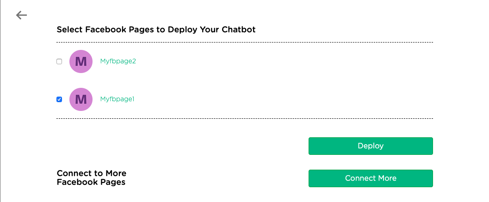

Check the page(s) you want to deploy to. Then click on the green `Deploy` button to complete the deployment.

If you cannot find some of your pages on the list, they probably don't have the permission for Juji to deploy your chatbot on them. In that case, you can click on `Connect More` to adjust your pages' permissions first.

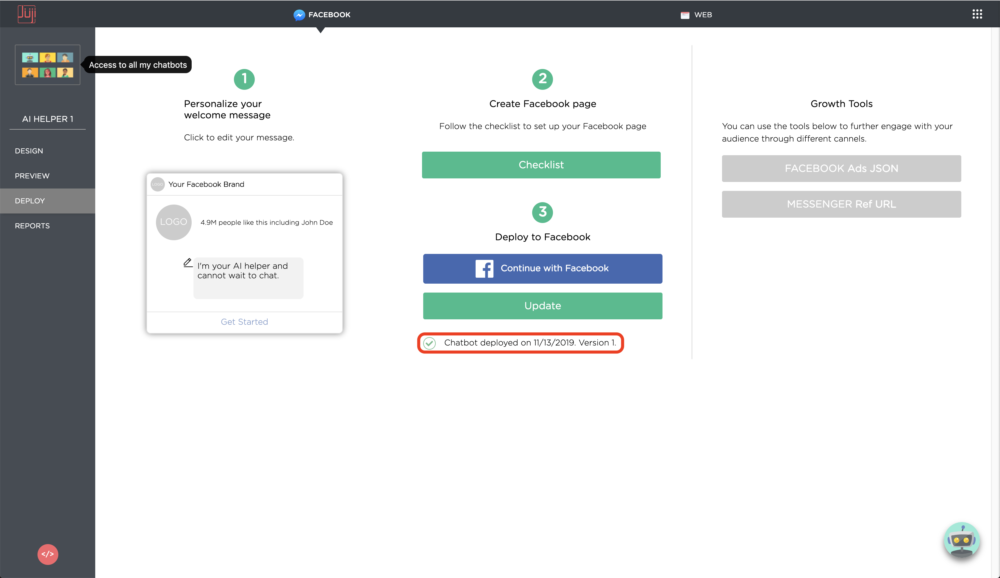

After you successfully deployed your chatbot to your facebook page, you will see the confirmation message on your deployment page as `Chatbot deployed on XX/XX/XXXX. Version X.`

## It's live now! :tada: :fireworks: :dizzy:

Now you can go your facebook page to test your chatbot.

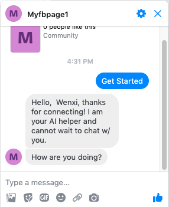

Once the chatbot is deployed, it is always on your page unless your take it down. So you can use it to interact with your audience for your products and services.

I you are wondering what you can do with your chatbot, you can check out our next section [**Chatbot Design**](design.md).

<!-- Now you get to a page where you could customize the cover page of your bot. We
can do that later. Click `Next` at the right bottom.

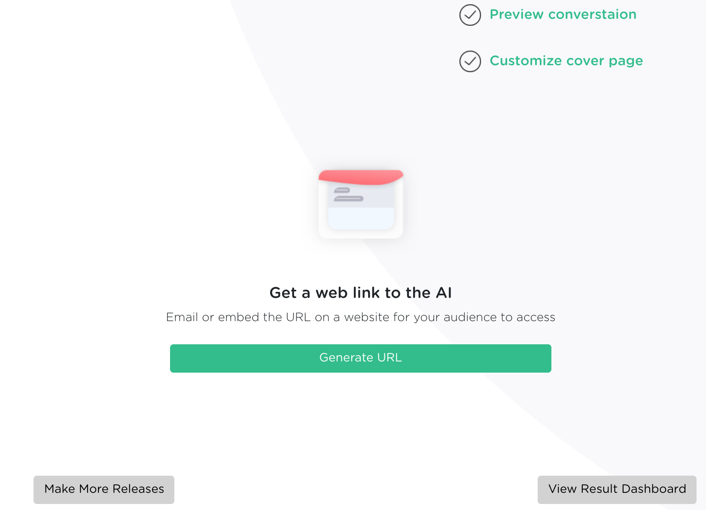

Click `Generate URL`

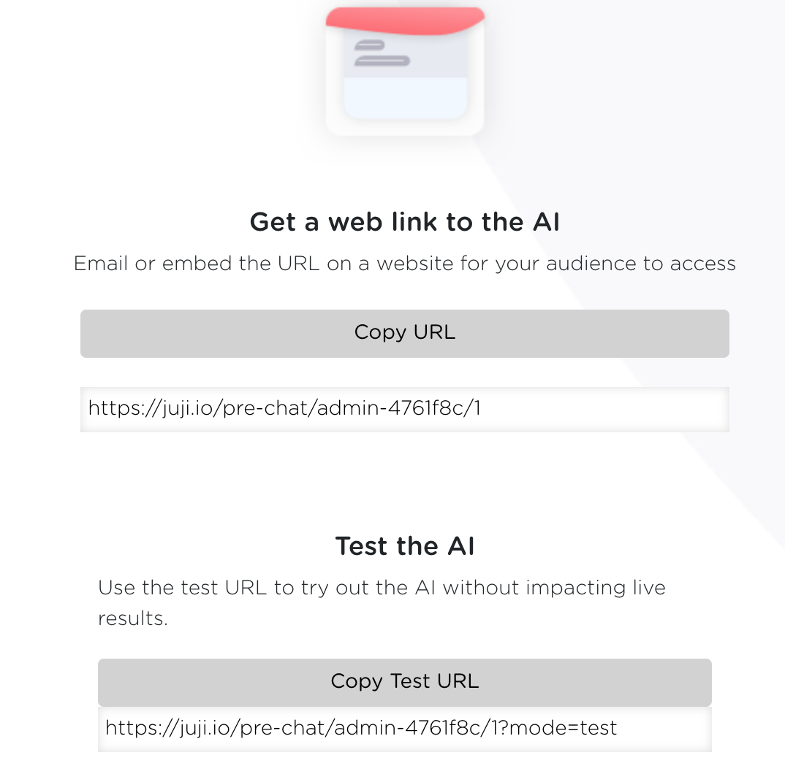

Now your bot is deployed.

You have two URLs. The first URL is the production deployment of your bot. The
second URL is for sending to your friends for testing. The two URLs host the
same chat bot, but the later will not be included in your results reporting. -->

<!-- ## Chat with your first chatbot

Point your browser to the URL generated above.

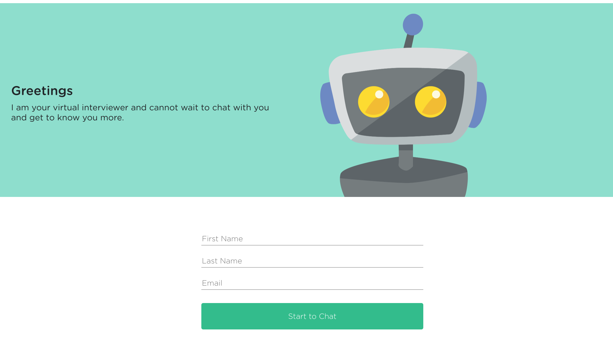

Only first name is required for chatting with Juji bots (but is configurable by you).

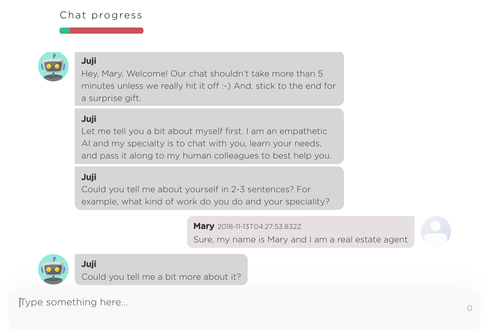

You are now chatting with your first deployed Juji bot! As could thousands of
others at the same time, for 24 hours a day and 7 days a week! -->
