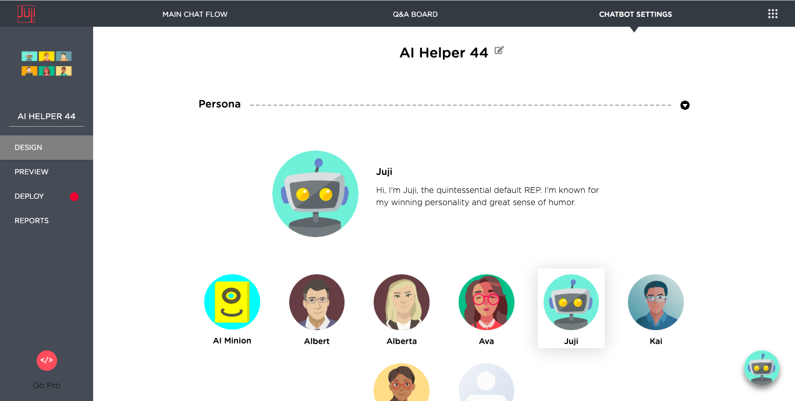
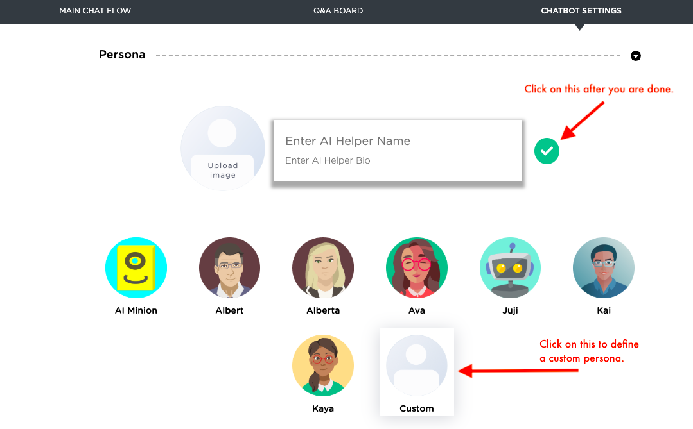
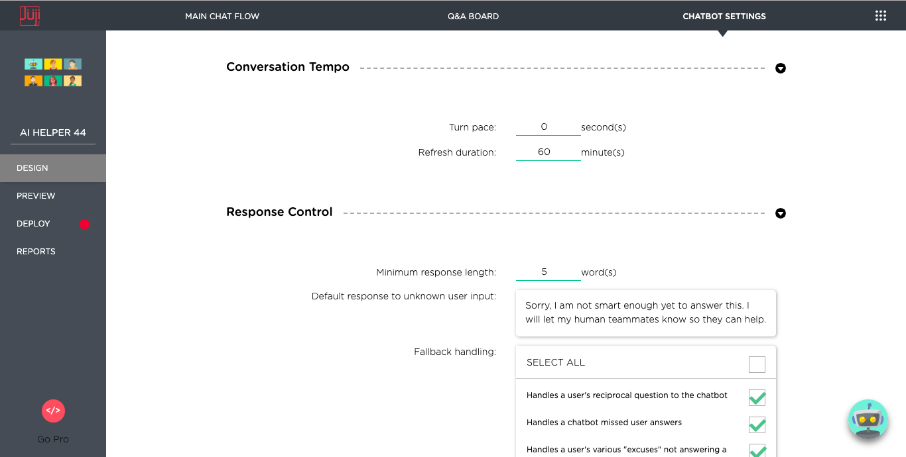

# **Customize Chatbot Settings**

In addition to customizing the main chat flow and the Q&A list, one
can also customize various chatbot settings, including the name of the project.

## Customize Project Name

You can edit the `name` of the project by mouse hovering the project
name and then click on the `pencil` button.

## Customize Chatbot Persona

To personalize your chatbot, you can choose a stock persona or define a custom persona.

 

To define a custom persona, click on the `Custom` persona icon as shown below. You can then upload your persona photo, give your custom persona a name, and enter a short bio. Once you are done, click on the green check mark to save it.

## Customize Conversation Parameters
You can also customer other chatbot parameters, such as setting a
`conversation pace` and `user response` requirement as shown below. 

### **Conversation pace**

You can speed up or slow down a chatbot transitions from one topic to the next.

### **Refresh duration**

You can also control how frequently a chatbot auto starts itself from
the beginning. In certain situations, you wish a chatbot to start more
frequently (e.g., an e-commerce chatbot) than others (e.g., an
interview chatbot) to make sure that users can accomplish their tasks
without starting over again.

### **Minimal response length**

This is a short cut for you to control the minimal number of words a
user must provide to a chatbot request. This parameter sets the
default for *all* questions in your chatbot. You can customize the response length for a specific chabot question/request in the **Topic Settings** (see [customize topic settings](../customize-main-chat-flow#Customize-Topic-Settings).

### **Default response to unknown user input**

This section allows you to control a chatbot's behavior when the chatbot does not recognize a user question or input. Currently, Juji provides several options for you to handle such a situation.

* Provide a default message. Juji has a built-in message to handle this. You can enter a custom message here to suit your context, e.g., providing a URL, an email, or a phone number to access a human agent.

* Provide email notification. If you enable this function, your chatbot will automatically elicit an email address, first name, and last name from a user. It will also automatically email the question along with the answer to the user once the answer becomes available (e.g., an answer is submitted via the Q&A board).

### **Fallback handling**

This allows you to control what kind of
    fallback handling is desired for your chatbot. Juji provides a
    rich list of fallback handling functions to manage user input that
    is outside of your chatbot script. From our experience, users
    often deviate from your chatbot script and start a side
    talkng. These fallback handling functions enable your chatbot to
    handle user-initiated side talking gracefully and also keep the
    chat on track. 

## What's Next

Once a chatbot is ready, you can deploy it onto a website or a
Facebook page. Please check out [**Chatbot Deployment**](../release)
to deploy your AI chatbot. If you wish to further customize your chatbot, such as its [**main chat flow**](../customize-main-chat-flow) or [**capabilities to handle QnA**](../customize-qa), you can continue doing so. 

