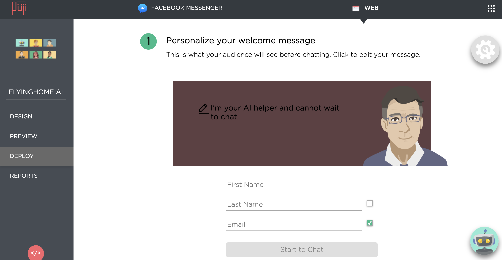
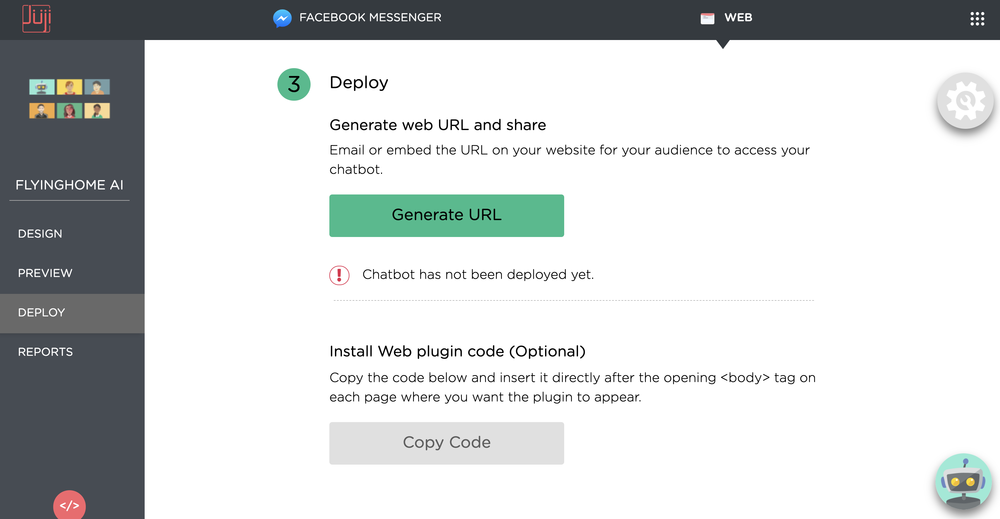

# **Deploy AI Chatbot**

Juji AI chatbots can be deployed to a website or to a Facebook
Messenger on a Facebook page.

## **Deploy to Website**

When deploying a chatbot to a website, one can customize the **web
cover** page. As shown below, one can edit the **welcome message** and
configure the fields to be shown on the cover page:

* First Name (required)
* Last Name (optional)
* Email (optional)

<p align="center"></p>

### **Activity Tracking**

An optional activity tracking setting is provided for page-owners who want to track their visitors' chat activities on their page. In case you are not interested in adding activity tracking, you can safely skip this section and go directly to [Generate URL](#generate-url).

<p align="center"></p>

There two types of activity tracking are supported: 1) Juji chat status tracking with HTML element, and 2) integration with existing Google Analytics on the page. The two types are not excluded, enabling the second type will also enable the first.

#### **Juji Chat Status Tracking with HTML Element**

This is a very flexible status tracking to use, because it let you define your own action when the chat status changes. To enable this tracking, you need to 

1. fill in the **Web URL** field in Step 2 with the origin of your page;
2. update your release if you already deployed your chatbot, so the web plugin code and the corresponding Juji chat page include your latest tracking info;
3. install the updated web plugin code on your page (regardless which web plugin setting you choose).

After you perform the steps above, a hidden HTML input element with id "juji-chat-status" will be included on your website (i.e., `<input id='juji-chat-status' type='hidden' value='not chatted'>`). When your visitor starts the Juji chat, the value of the element will change from "not chatted" to "chatted". Moreover, a "change" event will be dispatched to the element object. As a results, you can listen to such "change" event and perform all kinds of actions (e.g., sending info to your analytics etc.). Below is a simple example HTML script that sends an alert to the page when the chat is initiated by the visitor.

```html
<script>
  var chatStatusElement = document.getElementById('juji-chat-status');
  chatStatusElement.addEventListener(
      'change',
      function() {alert("Juji chat started!");}
  );
</script>
```

#### **Google Analytics Integration**

To enable Google Analytics Integration, you will need to fill in all three fields listed in Step 2: Domain, Web URL and ID.

* **Web URL**: the origin of your page, this will typically be scheme + `://` + domain, e.g., `https://mozilla.org`. If you are familiar with JavaScript, you may find this URL by checking `window.location.origin;` inside the web console on your page.
* **Domain**: the domain of your page without the scheme or path, e.g., `mozilla.org`
* **ID**: the Google Analytics tracking ID. You can get this ID on your Google Analytics page, go to Admin > Property Settings > Tracking Info > Tracking Code > Tracking ID. The ID will have format similar to `UA-123456789-1`.

Once the activity tracking is enabled, your deployed Juji web chat page will be updated with your tracking info. 

**Web Widget Google Analytics Integration**: If you are using Juji web widget on your page, you simply insert your web plugin code as instructed in the [Deploy as Web Widget](#deploy-as-web-widget) section below. The code gets updated automatically with your activity tracking setting, so if you change your setting here, make sure you use the updated web plugin code. 

**Web URL Google Analytics Integration**: If you are using web URL directly and you want to have cross-domain tracking between your site and your Juji chat, you will need to perform the following two actions in order to ensure the chat activities appear appropriately inside your Google Analytics.
  
  1. Copy the GA SECTION from the web plugin code and insert it directly after the opening <body> tag on each page where you want the linking happen. However, if you already have Google Analytics linker set up, just add the domains to your existing linkers.
  2. Adding "juji.ai" to your Google Analytics referral exclusion list at Admin > Property Settings > Tracking Info > Referral Exclusion List

After everything is set up correctly, wait for a day for the Google Analytics change kicks in. Then you will see pageviews similar to `/chat/606c1558-d290-4387-b870-8462ae3e3ee5`. Such pageviews tell you those visitors have chatted with your Juji chatbot.

##### Ensure single session 
Google Aanalytics by default triggers a new session when traffic arrives to your site from a different domain. This means your user's session count could artificially be doubled if they come to your site and chat with the chatbot then click on some link inside your chatbot to get back to your site. However, as this is very common issue, Google provide a simple solution to this - adding the other domain ("juji.ai" in this case) into your referral exclusion list. And [here](https://support.google.com/analytics/answer/2795830) is how you can do that.

#### Quick Start with the Chat Activity Info on Google Analytics
A good way to use the extra piece of chat activity info after Google Analtyics integration is to create two segments in your Google Analytics View - "chatted" and "not chatted", and use them to evaluate your chatbot's influence on your page.

To create segments, you go to Admin > View Settings > Segments > + NEW SEGMENT. For "chatted" segment, you edit the Seqences as shown below:

<p align="center"></p>

For "not chatted" segment, you change the filter type from "Include" to "Exclude":

<p align="center"></p>

Alternatively, you may import the prebuilt segments to your Google Analytics account by clicking into the following links:

  * chatted: https://analytics.google.com/analytics/web/template?uid=x_wa63uXQVSOlw-SPgW2qg
  * not chatted: https://analytics.google.com/analytics/web/template?uid=wfFkNpiEQd-Bw8GK3a6hAA

Now, you can add the new segments in our metrics tables (Goals, Site Content etc.), and see how they perform. 

<p align="center"></p>

#### Integration with Google Tag Manager

The activity tracking setting also works with Google Tag Manager, but it will require some setup in Google Tag Manager. Please contact support at(@) juji.io if you need assistance on setting up activity tracking with your Google Tag Manager. 

#### Troubleshooting
1. "We are able to deploy the code in our page, but the value of the input tag with id=juji-chat-status does not get updated from not chatted to chatted once we click on Start Chat button."

Usually this means the parent page (your page) does not receive the post message from the child page (iframe). And usually this is because the parent origin is not the same as the Web URL value we gather from the chatbot configuration. So when you have this issue, the first thing you want to do is to double check if the Web URL field in the SECTION 2 on the DEPLOY page of your chatbot has the right value (as shown [here](#activity-tracking))? As described above, it should be the origin of your page (i.e. run `window.location.origin;` in your web console on your page to get the exact origin).

### **Generate URL**

Use the `Generate URL` button to generate a web URL. This URL can then
be embedded into an email or a website for target audience.

<p align="center"></p>

Two URLs are generated:

* **Test Link** Give this URL to testers so that the chat data can be
  identified as test data easily.

* **Web Link** Use this URL for target audience. 

<p align="center"></p>

### **Customize Web URL with External Data**
In some cases, you may want to customize the generated chatbot URL
with additional information for various purposes. For example, if you
use a chatbot to conduct surveys or onboard customers, you may want to
append a unique user id to the chatbot URL and send this URL to
qualified participants or customers.  You can also append additional
information, such as source or session information, to track where the
users obtained your chatbot URL.

It's super easy to pass such external information to Juji. You just
need to append the information to the chatbot URL. For example, the
following Juji URL is appended with `?source=email` to identify that
this chatbot URL will be emailed to the target audience:

`https://juji.ai/pre-chat/5df866e6-e911-4924-b9e1-7440038825c6?source=email`

In contrast, the following indicates the URL will be posted on
Linkedin:

`https://juji.ai/pre-chat/5df866e6-e911-4924-b9e1-7440038825c6?source=linkedin`

Juji will automatically capture such *external* information in its
reports. For example, two entries below from the CSV report file show
the captured source information (see [how to download a CSV
report](../reports)).

<p align="center"></p>

### **Deploy as Web Widget**

If you don't want your visitors to be redirected to another page, you can make your chatbot live on your page as a web widget. It will look similar to the Juji chatbot at the bottom right of this documentation page.

To add such widget, after you go through the web deployment process, instead of copying the URL, you copy the web plugin code that appears below the URL. Then, simply insert it directly after the opening `<body>` tag on each page where you want the widget to appear.

<p align="center"></p>

The web plugin code gets updated automatically with your activity tracking in step 2 of the web deployment process. If you have activity tracking enabled, you will see a "GA SECTION" in the web plugin code. The section is required for linking your site and the Juji's chat page. However, if you are already setting Google Analytics linkers, pleaser remove the GA section and add the linker domains into your existing linker setting.

## **Deploy to Facebook Page**

One can deploy a Juji chatbot to a Facebook Messenger associated with
a Facebook page.


<p align="center"></p>

Similar to deploying to a website, one can also edit the **weclome
message** shown up in a Facebook Messenger. Click on the green
`Checklist` to make a Facebook page ready to host a chatbot.

Use the blue `Connect with Facebook` button to deploy a
chatbot. Select the page(s) you want to deploy to. Then click on the
green `Deploy` button to complete the deployment.

<p align="center"></p>

If there is no page listed, it means that you have not given Juji
permissions to any of your Facebook pages to host your
chatbots. In that case, click on the green `Connect More` button to
select Facebook pages and give permissions. The permitted pages should
then show up in the list and you can then select one or more to deploy a
chatbot to.  

## **Update Deployed Chatbot**
It's possible that a chatbot needs to be updated after its
deployment. For example, you may want to add a new chatbot question or
update the wording of an existing chatbot request. To push the new
updates to the deployment, Juji supports two types of update:

* **Update Existing Release** Use the `Update` button on the Facebook
    deployment page (see below) or the one under the
    `Manage` button to push the updates to the existing chatbot. The
    updated chatbot will restart and reflect the changes made.

### **Update Facebook Chatbot**
<p align="center"></p>

<br>

### **Update Web Chatbot**
<p align="center"></p>

* **New Release** Use the `Connect with Facebook` button or `New
    Release` button under `Manage` to release a new version of the
    chatbot. A new release version will be created.


### **Best Practices**

How do you decide whether to update a chatbot vs. to make a new
release or version of the chatbot?  While the decision is completely
up to you, we recommend that you normally just `update` a chatbot
without making a new release/version of it. If you make substantial
changes, such as adding questions or attributes, to a chatbot, we
recommend that you make a new release of the chatbot
(basically with a new version number). This is because data fields
(e.g., chatbot questions or custom attributes) could be very different
between two releases and you don't wish to mix the old and new data
together. Making a new release will also facilitate easier comparison
of audience behavior under different chatbot versions.

Note that the current [Reports](../reports) page shows the audience
information for the most recent release/version of chatbot. If you
make a new release, currently you may not be able to access the audience
information for previous releases.

## **What's Next**

Once a chatbot is deployed, you can monitor its status and the
associated audience information. Please check out [**Report
Dashboard**](reports.md) to deploy your AI chatbot. 

